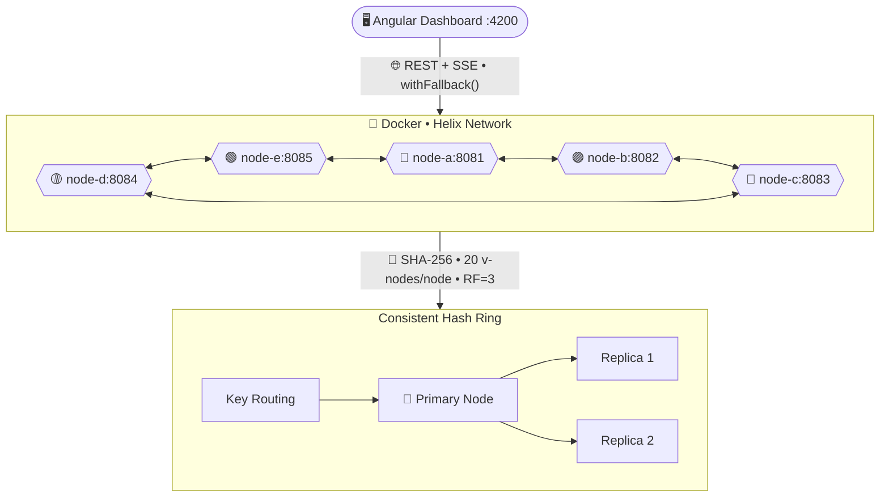
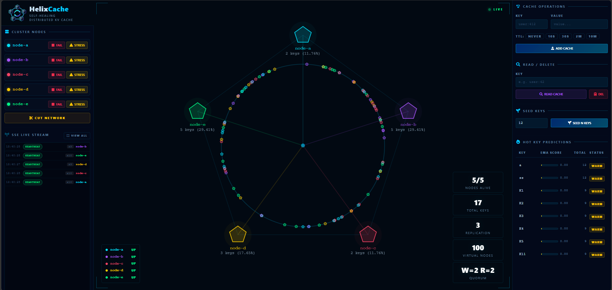
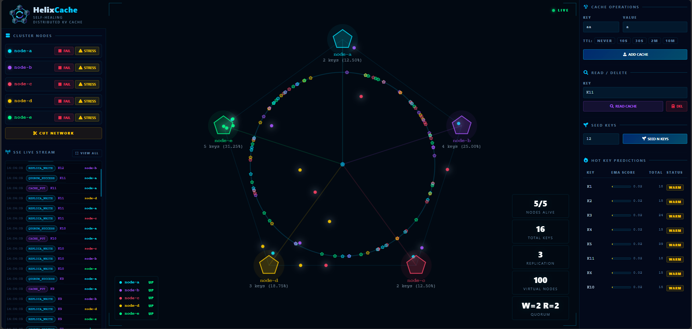
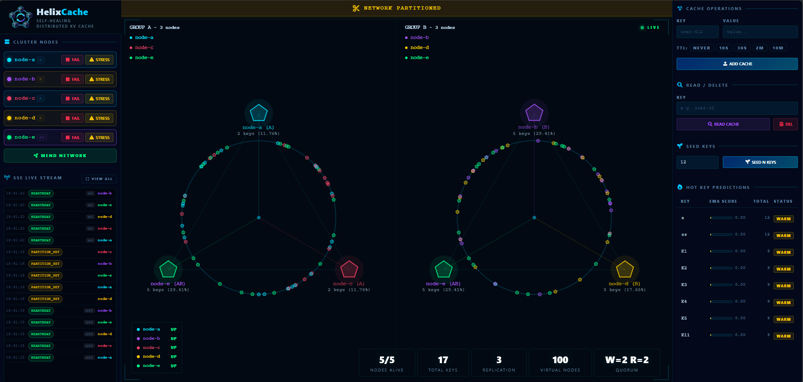
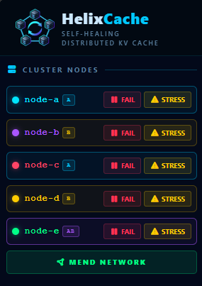
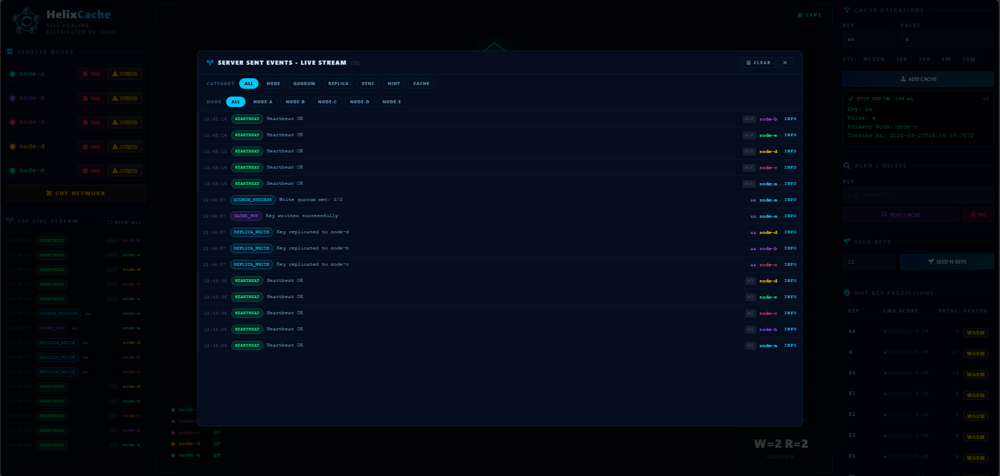
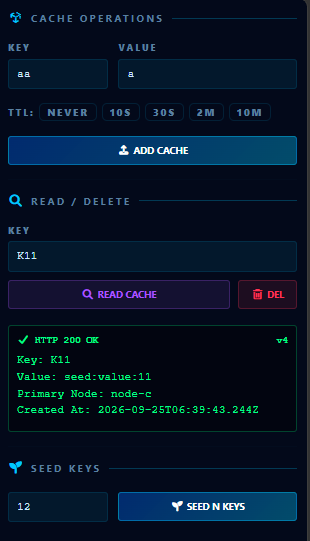
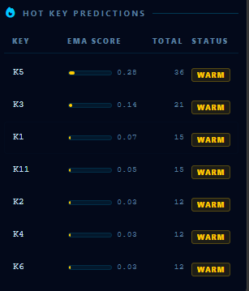

<p align="center">
    
</p>
<h1 align="center" style="color: #cce8ff">Helix<em style="color: #00c8ff;">Cache</em></h1>

<p align="center">
    Self-Healing Distributed Key-Value Cache
</p>

<p align="center">
    
    
    
    
</p>


> *Implemented a SHA-256-based consistent hash ring with virtual nodes for key distribution, quorum-based replication (W=2 / R=2, RF=3),
hinted handoff for write durability, anti-entropy sync on recovery, and self-healing failover across a 5-node Docker cluster.*
>
> *Built an observability platform with SSE event streaming, hash-ring visualization, request and replica tracing, network partition and split-brain simulation, 
Prometheus metrics, and an EMA-driven hot-key prediction engine for cluster-wide workload analysis.*

---

## Architecture
Every node runs the same binary. Cluster role and key ownership are determined at runtime by the consistent hash ring.
The Angular dashboard connects to any live node via `withFallBack()` - cascading through all 5 URLs on failure.



---
## Core Features
### Consistent Hashing
- SHA-256 ring with **20 virtual nodes per physical node** -> 100 ring positions
- Clockwise traversal for key ownership and replica selection
- Node addition/removal migrates only adjacent key ranges - zero global re-hash

### Quorum Replication
- **RF=3** replicas per key; write acknowledged after **W=2**, read from all then LWW by `version`
- Hinted handoff - failed replica writes queued in-memory, delivered on node recovery
- Idempotent deletes - "Cache not found" on a replica counts as success

### Self-Healing Failover
- Heartbeat scheduler pings all peers every **5s**
- `SUSPECT` at 2 missed heartbeats -> `DOWN` at 4 -> removed from ring
- On recovery: **anti-entropy synchronization** pushes missing keys before node re-joins ring

### Network Partition Simulation
- Per-node blocked-peer list intercepts outbound calls - simulates Byzantine network cuts
- Group A / Group B isolation with optional neutral nodes
- Partition state reconstructed from backend on page reload - dual-ring view persists

### Hot-Key Prediction Engine
- 60s sliding window (6 buckets x 10s) per key
- **EMA scoring** (α=0.4) - keys exceeding 2.0 req/s flagged as hot
- Predictions refreshed every 10s

### Real-Time Observability
- **SSE event pipeline** - 20+ event types: replica writes, quorum results, node health changes, partition events, conflict detection 
- Exact distinct key count via cross-node `Set<String>` union (no approximation)
- Per-node primary key count, distribution %, missed heartbeats, last-seen

--- 

## Dashboard

### Hash Ring View
 
*Live SVG ring - virtual nodes, replica travel dots, burst animations on node failure, UP / SUSPECT / DOWN state*

### Network Partition Dual Ring

*Split-brain simulation Group A and Group B isolated with scoped replication animations*

### Node Control & Failure Injection

*Pause, resume, throttle, partition, and heal individual nodes in real time*

### Activity Log

*SSE-driven event log - filterable by event category and node, with mergeable repeated events*

### Cache Operations

*Cache add, read, delete along with seed keys to add multiple keys at single click*

### Hot-Key Predictions

*EMA-scored access tracker - predicted hot keys flagged with recent rate and total access count*

---

## Quick Start

```bash
# -> Clone and start the cluster
git clone https://github.com/your-username/helix-cache.git
cd helix-cache/docker
docker-compose up -build

#Start the UI
cd ../helix-ui
npm install
ng serve

# -> http://localhost:4200
```

## API Reference

| Method   | Endpoint                   | Description                                       |
|----------|----------------------------|---------------------------------------------------|
| `PUT`    | `cache/{key}?ttlSeconds=`  | Quorum write with optional TTL                    |
| `GET`    | `/cache/{key}`             | Quorum read - Last-Write-Wins across replicas     |
| `DELETE` | `/cache/{key}`             | Quorum delete                                     |
| `GET`    | `/cluster/nodes`           | Status, key count, heartbeat info for all nodes   |
| `GET`    | `/cluster/ring`            | Full hash ring state with virtual node positions  |
| `GET`    | `/cluster/stats/global`    | Exact distinct key count via cross-node set union |
| `GET`    | `/cluster/replicas/{key}`  | Primary + replica nodes for a given key           |
| `GET`    | `/cluster/events/stream`   | SSE stream of all cluster events                  |
| `POST`   | `/admin/node/partition`    | Inject network partition (set blocked peers)      |
| `PUT`    | `/admin/node/heal`         | Heal partition - clear all blocked peers          |
| `PUT`    | `/admin/node/pause`        | Simulate node unavailability (503)                |
| `GET`    | `/admin/stats/predictions` | EMA-scored hot-key predictions                    |

---
## Tech Stack
|                    | Technology                                                                  |
|--------------------|-----------------------------------------------------------------------------|
| **Backend**        | Java 17 • Spring Boot 3 • REST APIs • Lombok                                |
| **Frontend**       | Angular 17 Signals • RxJS • SVG                                             |
| **Distributed**    | Consistent hashing • Quorum consensus • Hinted handoff • Anti-entropy • LWW |
| **Observability**  | SSE • EMA hot-key scoring • Sliding window access tracking                  |
| **Infrastructure** | Docker • docker-compose • Multi-stage build                                 |

--- 
## Design Decisions

| Decision                              | Rationale                                                                   |
|---------------------------------------|-----------------------------------------------------------------------------|
| SHA-256 for ring positions            | Uniform 63-bit distribution; `ThreadLocal<MessageDigest>` avoids contention |
| Virtual nodes (x20)                   | Smooths key distribution across heterogeneous or recovering nodes           |
| Hinted handoff over immediate failure | Preserves write durability without blocking the client                      |
| Anti-entropy sync before ring re-join | Prevents serving stale reads from a recovering node                         |
| SSE over WebSocket                    | Unidirectional server push is sufficient; simpler to scale and proxy        |
| EMA over raw rate                     | Exponential smoothing reduces noise from short access bursts                |